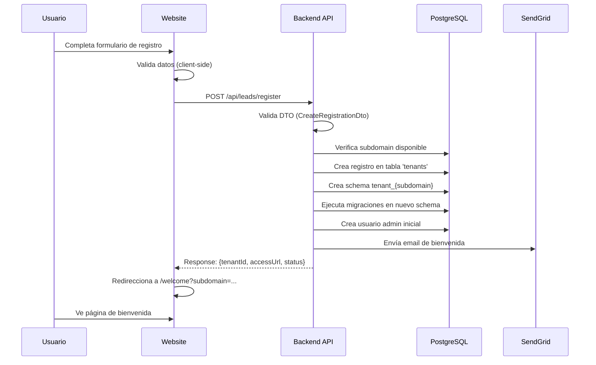
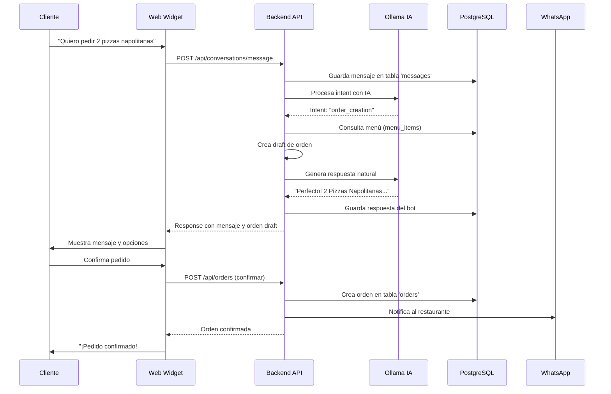
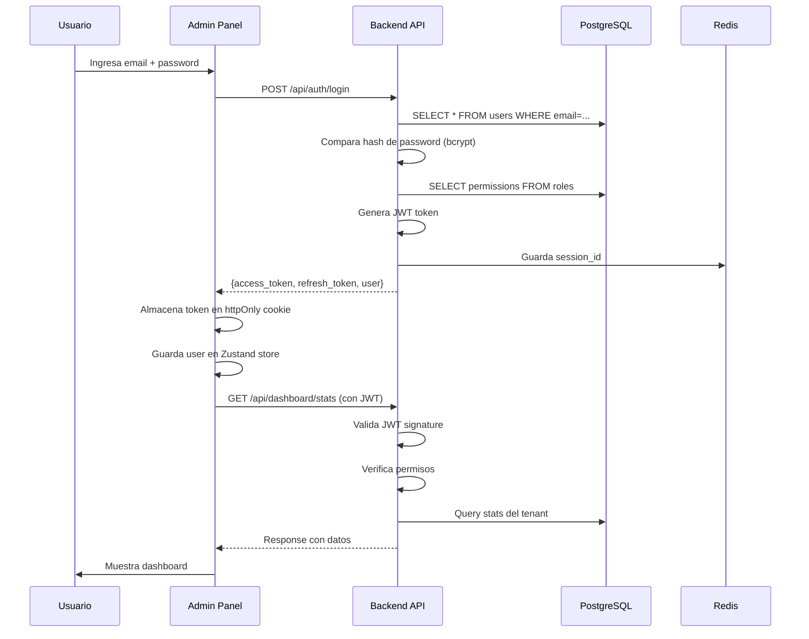

# 🏗️ Arquitectura Oficial del Sistema - ChatBotDysa Enterprise+++++

**Fecha:** 11 de Noviembre, 2025
**Versión del Sistema:** Enterprise+++++
**Autor:** DevOps & Architecture Team
**Estado:** Producción Activa

---

## 📋 Tabla de Contenidos

1. [Visión General](#visión-general)
2. [Arquitectura de Alto Nivel](#arquitectura-de-alto-nivel)
3. [Componentes del Sistema](#componentes-del-sistema)
4. [Stack Tecnológico](#stack-tecnológico)
5. [Arquitectura de Red](#arquitectura-de-red)
6. [Arquitectura de Datos](#arquitectura-de-datos)
7. [Arquitectura de Seguridad](#arquitectura-de-seguridad)
8. [Flujos de Trabajo Principales](#flujos-de-trabajo-principales)
9. [Integraciones Externas](#integraciones-externas)
10. [Escalabilidad y Alta Disponibilidad](#escalabilidad-y-alta-disponibilidad)
11. [Monitoreo y Observabilidad](#monitoreo-y-observabilidad)
12. [Estructura del Proyecto](#estructura-del-proyecto)

---

## 🎯 Visión General

### Descripción del Sistema

**ChatBotDysa Enterprise+++++** es una plataforma SaaS multi-tenant de inteligencia artificial conversacional diseñada específicamente para la industria de restaurantes en Chile. El sistema proporciona:

- **Chatbot IA** con procesamiento de lenguaje natural
- **Gestión integral de operaciones** de restaurantes
- **Panel de administración** multi-tenant
- **Website de marketing** para captación de leads
- **Widget embebible** para sitios web de clientes
- **Integraciones** con WhatsApp, Twilio, Ollama y servicios de pago

### Principios de Arquitectura

1. **Multi-Tenancy:** Aislamiento completo entre restaurantes
2. **Microservicios:** Separación de responsabilidades
3. **API-First:** Toda funcionalidad expuesta vía REST API
4. **Escalabilidad Horizontal:** Capacidad de crecer según demanda
5. **Seguridad por Diseño:** Autenticación JWT, RBAC, validación exhaustiva
6. **Cloud-Native:** Contenedorización Docker, orchestración Kubernetes
7. **Observabilidad:** Logs centralizados, métricas, trazas distribuidas

---

## 🏛️ Arquitectura de Alto Nivel

```
┌─────────────────────────────────────────────────────────────────────────┐
│                          CAPA DE PRESENTACIÓN                           │
├─────────────────────────────────────────────────────────────────────────┤
│                                                                         │
│  ┌─────────────┐  ┌─────────────┐  ┌─────────────┐  ┌─────────────┐  │
│  │   Website   │  │Admin Panel  │  │Web Widget   │  │Landing Page │  │
│  │ (Marketing) │  │(Restaurants)│  │  (Cliente)  │  │  (Public)   │  │
│  │             │  │             │  │             │  │             │  │
│  │ Port: 6001  │  │ Port: 7001  │  │ Port: 7002  │  │ Port: 3004  │  │
│  │ Next.js 14  │  │ Next.js 14  │  │   React     │  │ Next.js 14  │  │
│  └──────┬──────┘  └──────┬──────┘  └──────┬──────┘  └──────┬──────┘  │
│         │                 │                 │                 │         │
└─────────┼─────────────────┼─────────────────┼─────────────────┼─────────┘
          │                 │                 │                 │
          └─────────────────┴─────────────────┴─────────────────┘
                                     │
                                     ▼
┌─────────────────────────────────────────────────────────────────────────┐
│                        CAPA DE API GATEWAY                              │
├─────────────────────────────────────────────────────────────────────────┤
│                                                                         │
│                      ┌───────────────────────┐                         │
│                      │  Backend API (NestJS) │                         │
│                      │                       │                         │
│                      │   Port: 8005          │                         │
│                      │   /api/v1/*           │                         │
│                      │                       │                         │
│                      │   - REST Endpoints    │                         │
│                      │   - JWT Auth          │                         │
│                      │   - Validation        │                         │
│                      │   - Rate Limiting     │                         │
│                      │   - Swagger Docs      │                         │
│                      └───────────┬───────────┘                         │
│                                  │                                     │
└──────────────────────────────────┼─────────────────────────────────────┘
                                   │
            ┌──────────────────────┼──────────────────────┐
            │                      │                      │
            ▼                      ▼                      ▼
┌─────────────────────┐ ┌─────────────────────┐ ┌─────────────────────┐
│  CAPA DE NEGOCIO    │ │ CAPA DE SERVICIOS   │ │  CAPA DE DATOS      │
├─────────────────────┤ ├─────────────────────┤ ├─────────────────────┤
│                     │ │                     │ │                     │
│ ┌─────────────────┐ │ │ ┌─────────────────┐ │ │ ┌─────────────────┐ │
│ │ Auth Module     │ │ │ │ Ollama Service  │ │ │ │  PostgreSQL     │ │
│ │ Users Module    │ │ │ │ (IA Processing) │ │ │ │  Port: 15432    │ │
│ │ Customers       │ │ │ ├─────────────────┤ │ │ │                 │ │
│ │ Orders          │ │ │ │ WhatsApp API    │ │ │ │ - Multi-tenant  │ │
│ │ Menu            │ │ │ │ (Messaging)     │ │ │ │ - JSONB support │ │
│ │ Reservations    │ │ │ ├─────────────────┤ │ │ │ - Full-text     │ │
│ │ Conversations   │ │ │ │ Twilio Service  │ │ │ │ - Replication   │ │
│ │ Leads (NEW)     │ │ │ │ (SMS/Voice)     │ │ │ └─────────────────┘ │
│ │ Analytics       │ │ │ ├─────────────────┤ │ │                     │
│ │ Settings        │ │ │ │ Payment Gateway │ │ │ ┌─────────────────┐ │
│ └─────────────────┘ │ │ │ (Mercado Pago)  │ │ │ │  Redis          │ │
│                     │ │ ├─────────────────┤ │ │ │  Port: 16379    │ │
│                     │ │ │ Email Service   │ │ │ │                 │ │
│                     │ │ │ (SendGrid)      │ │ │ │ - Sessions      │ │
│                     │ │ ├─────────────────┤ │ │ │ - Cache         │ │
│                     │ │ │ Storage Service │ │ │ │ - Pub/Sub       │ │
│                     │ │ │ (S3/CloudFlare) │ │ │ │ - Rate Limit    │ │
│                     │ │ └─────────────────┘ │ │ └─────────────────┘ │
│                     │ │                     │ │                     │
└─────────────────────┘ └─────────────────────┘ └─────────────────────┘
```

---

## 🔧 Componentes del Sistema

### 1. **Backend API** (NestJS)

**Ubicación:** `/apps/backend`
**Puerto:** 8005
**Función:** API REST principal del sistema

**Módulos Principales:**

| Módulo | Descripción | Endpoints |
|--------|-------------|-----------|
| **Auth** | Autenticación y autorización | `/api/auth/*` |
| **Users** | Gestión de usuarios del sistema | `/api/users/*` |
| **Customers** | Gestión de clientes de restaurantes | `/api/customers/*` |
| **Orders** | Gestión de pedidos | `/api/orders/*` |
| **Menu** | Gestión de menú de productos | `/api/menu/*` |
| **Reservations** | Gestión de reservas | `/api/reservations/*` |
| **Conversations** | Gestión de conversaciones con IA | `/api/conversations/*` |
| **Leads** | Captación de leads (demo/registro) | `/api/leads/*` |
| **Analytics** | Dashboard y reportes | `/api/analytics/*` |
| **Settings** | Configuración del sistema | `/api/settings/*` |
| **Payments** | Procesamiento de pagos | `/api/payments/*` |

**Tecnologías:**
- NestJS 10.x
- TypeScript 5.x
- TypeORM para ORM
- Class-validator para DTOs
- Passport.js para autenticación
- Swagger para documentación

---

### 2. **Admin Panel** (Next.js)

**Ubicación:** `/apps/admin-panel`
**Puerto:** 7001
**Función:** Panel de administración para restaurantes

**Páginas Principales:**

```
/                           → Login
/dashboard                  → Dashboard principal con KPIs
/customers                  → Gestión de clientes
/orders                     → Gestión de pedidos
  /orders/new              → Crear nuevo pedido
/menu                       → Gestión del menú
/reservations               → Gestión de reservas
/conversations              → Chat con IA
  /conversations/new       → Nueva conversación
  /conversations/:id       → Detalle de conversación
/analytics                  → Reportes y analíticas
/settings                   → Configuración
  /settings/profile        → Perfil de usuario
  /settings/restaurant     → Datos del restaurante
  /settings/integrations   → Integraciones
/users                      → Gestión de usuarios del sistema
```

**Características:**
- Server-Side Rendering (SSR)
- React Server Components
- Client Components interactivos
- Autenticación JWT
- Tema oscuro/claro
- Responsive design
- Internacionalización (es/en)

**Tecnologías:**
- Next.js 14
- React 18
- TypeScript
- TailwindCSS
- Shadcn/ui components
- React Query para estado
- Zustand para estado global

---

### 3. **Website Marketing** (Next.js)

**Ubicación:** `/apps/website`
**Puerto:** 6001
**Función:** Sitio web de marketing y captación de leads

**Páginas Principales:**

```
/                    → Homepage con hero, features, pricing
/demo                → Formulario solicitud de demo
/registro            → Formulario de registro de restaurante
/welcome             → Página de bienvenida post-registro
/planes              → Planes y precios detallados
/casos-exito         → Casos de éxito de clientes
/blog                → Blog con artículos
/contacto            → Formulario de contacto
/checkout/payment    → Página de pago
/terminos            → Términos y condiciones
/privacidad          → Política de privacidad
```

**Características:**
- Static Site Generation (SSG)
- SEO optimizado
- Performance optimizado (Core Web Vitals)
- Formularios con validación
- Integración con backend para leads
- Calculadora de ROI interactiva
- Animaciones con Framer Motion

**Tecnologías:**
- Next.js 14
- React 18
- TypeScript
- TailwindCSS
- Framer Motion
- React Hook Form
- Canvas Confetti

---

### 4. **Web Widget** (React)

**Ubicación:** `/apps/web-widget`
**Puerto:** 7002
**Función:** Widget embebible para sitios web de clientes

**Características:**
- Chat widget flotante
- Integración con Ollama AI
- Historial de conversaciones
- Notificaciones en tiempo real
- Personalizable por tenant
- Responsive
- Ligero (<100KB gzipped)

**Tecnologías:**
- React 18
- TypeScript
- TailwindCSS
- Socket.IO para real-time
- Rollup para bundling

---

### 5. **Landing Page** (Next.js)

**Ubicación:** `/apps/landing-page`
**Puerto:** 3004
**Función:** Landing page estática para campañas

**Características:**
- Ultra optimizada para conversión
- A/B testing compatible
- Analytics integrado
- Formulario lead capture
- CTA optimizado

---

## 📚 Stack Tecnológico

### Frontend

| Tecnología | Versión | Uso |
|------------|---------|-----|
| **Next.js** | 14.x | Framework React SSR/SSG |
| **React** | 18.x | UI Library |
| **TypeScript** | 5.x | Type-safety |
| **TailwindCSS** | 3.x | Estilos utilitarios |
| **Shadcn/ui** | Latest | Componentes UI |
| **Framer Motion** | 11.x | Animaciones |
| **React Query** | 5.x | Data fetching |
| **Zustand** | 4.x | Estado global |
| **React Hook Form** | 7.x | Formularios |
| **Zod** | 3.x | Validación schemas |

### Backend

| Tecnología | Versión | Uso |
|------------|---------|-----|
| **NestJS** | 10.x | Framework Node.js |
| **TypeScript** | 5.x | Type-safety |
| **TypeORM** | 0.3.x | ORM para PostgreSQL |
| **Passport.js** | Latest | Autenticación |
| **JWT** | 9.x | Tokens de autenticación |
| **Class-validator** | 0.14.x | Validación DTOs |
| **Swagger** | 7.x | Documentación API |
| **Bull** | 4.x | Job queues |

### Base de Datos

| Tecnología | Versión | Uso |
|------------|---------|-----|
| **PostgreSQL** | 15.x | Base de datos principal |
| **Redis** | 7.x | Cache y sesiones |
| **TypeORM Migrations** | Latest | Versionado de DB |

### Infraestructura

| Tecnología | Versión | Uso |
|------------|---------|-----|
| **Docker** | 24.x | Contenedorización |
| **Docker Compose** | 2.x | Orchestración local |
| **Nginx** | 1.25.x | Reverse proxy |
| **PM2** | 5.x | Process manager |

### Servicios Externos

| Servicio | Propósito |
|----------|-----------|
| **Ollama** | Procesamiento de IA conversacional |
| **WhatsApp Business API** | Mensajería WhatsApp |
| **Twilio** | SMS y llamadas |
| **Mercado Pago** | Procesamiento de pagos |
| **SendGrid** | Envío de emails transaccionales |
| **Cloudflare** | CDN y protección DDoS |

---

## 🌐 Arquitectura de Red

### Puertos y Servicios

```
┌─────────────────────────────────────────────────────────────────┐
│                    Servicios en Desarrollo                      │
├─────────────────────────────────────────────────────────────────┤
│                                                                 │
│  Puerto   │  Servicio            │  Protocolo  │  Público      │
│  ─────────┼──────────────────────┼─────────────┼──────────     │
│  6001     │  Website Marketing   │  HTTP       │  Sí           │
│  7001     │  Admin Panel         │  HTTP       │  Sí (Auth)    │
│  7002     │  Web Widget          │  HTTP       │  Sí           │
│  3004     │  Landing Page        │  HTTP       │  Sí           │
│  8005     │  Backend API         │  HTTP       │  Sí (/api)    │
│  15432    │  PostgreSQL          │  TCP        │  No           │
│  16379    │  Redis               │  TCP        │  No           │
│  11434    │  Ollama              │  HTTP       │  No           │
│                                                                 │
└─────────────────────────────────────────────────────────────────┘

┌─────────────────────────────────────────────────────────────────┐
│                    Servicios en Producción                      │
├─────────────────────────────────────────────────────────────────┤
│                                                                 │
│  Puerto   │  Servicio            │  Protocolo  │  Acceso       │
│  ─────────┼──────────────────────┼─────────────┼──────────     │
│  80       │  Nginx (HTTP)        │  HTTP       │  Público      │
│  443      │  Nginx (HTTPS)       │  HTTPS      │  Público      │
│  3000     │  Admin Panel         │  HTTP       │  Nginx proxy  │
│  3001     │  Website             │  HTTP       │  Nginx proxy  │
│  3002     │  Widget              │  HTTP       │  Nginx proxy  │
│  8005     │  Backend API         │  HTTP       │  Nginx proxy  │
│  5432     │  PostgreSQL          │  TCP        │  VPC privado  │
│  6379     │  Redis               │  TCP        │  VPC privado  │
│                                                                 │
└─────────────────────────────────────────────────────────────────┘
```

### DNS y Subdominios

```
chatbotdysa.com                    → Website Marketing (6001/3001)
www.chatbotdysa.com                → Redirect a chatbotdysa.com
api.chatbotdysa.com                → Backend API (8005)
admin.chatbotdysa.com              → Admin Panel (7001/3000)
widget.chatbotdysa.com             → Web Widget (7002/3002)
[tenant].chatbotdysa.com           → Admin Panel Multi-tenant
demo.chatbotdysa.com               → Demo environment
docs.chatbotdysa.com               → Documentación (Swagger)
```

---

## 💾 Arquitectura de Datos

### Modelo de Datos Multi-Tenant

**Estrategia:** Schema-per-tenant con tabla de routing

```sql
-- Tabla de Tenants (Schema public)
CREATE TABLE tenants (
  id UUID PRIMARY KEY DEFAULT gen_random_uuid(),
  subdomain VARCHAR(50) UNIQUE NOT NULL,
  name VARCHAR(255) NOT NULL,
  plan VARCHAR(50) NOT NULL,
  status VARCHAR(20) DEFAULT 'active',
  created_at TIMESTAMP DEFAULT NOW(),
  updated_at TIMESTAMP DEFAULT NOW()
);

-- Cada tenant tiene su propio schema
CREATE SCHEMA tenant_pizzanapoli;
CREATE SCHEMA tenant_sushiexpress;
-- etc...
```

### Entidades Principales

#### Schema: `public`

| Tabla | Descripción |
|-------|-------------|
| `tenants` | Registro de restaurantes (multi-tenant) |
| `system_users` | Usuarios administradores del sistema |
| `system_settings` | Configuración global |
| `migrations` | Control de versiones de DB |

#### Schema: `tenant_{subdomain}`

| Tabla | Descripción | Relaciones |
|-------|-------------|------------|
| `users` | Usuarios del restaurante | - |
| `roles` | Roles y permisos | → users |
| `customers` | Clientes del restaurante | - |
| `menu_categories` | Categorías del menú | - |
| `menu_items` | Items del menú | → menu_categories |
| `orders` | Pedidos | → customers, users |
| `order_items` | Items de pedidos | → orders, menu_items |
| `reservations` | Reservas de mesas | → customers |
| `conversations` | Conversaciones con chatbot | → customers |
| `messages` | Mensajes de conversaciones | → conversations |
| `payments` | Pagos procesados | → orders |
| `analytics_events` | Eventos para analytics | - |
| `settings` | Configuración del restaurante | - |

### Backup y Recuperación

- **Backup automático:** Cada 6 horas
- **Retención:** 30 días de backups diarios, 12 meses de backups semanales
- **Replicación:** Master-Slave para alta disponibilidad
- **Point-in-Time Recovery:** Habilitado
- **Ubicación:** S3-compatible storage (Cloudflare R2)

---

## 🔐 Arquitectura de Seguridad

### Capas de Seguridad

```
┌──────────────────────────────────────────────────────────────┐
│ 1. PERIMETRAL                                                │
├──────────────────────────────────────────────────────────────┤
│  - Cloudflare WAF                                            │
│  - DDoS Protection                                           │
│  - Rate Limiting (por IP)                                    │
│  - SSL/TLS 1.3                                               │
└──────────────────────────────────────────────────────────────┘
                              ↓
┌──────────────────────────────────────────────────────────────┐
│ 2. RED                                                       │
├──────────────────────────────────────────────────────────────┤
│  - VPC privado                                               │
│  - Security Groups                                           │
│  - Network ACLs                                              │
│  - Firewall rules                                            │
└──────────────────────────────────────────────────────────────┘
                              ↓
┌──────────────────────────────────────────────────────────────┐
│ 3. APLICACIÓN                                                │
├──────────────────────────────────────────────────────────────┤
│  - JWT Authentication                                        │
│  - RBAC (Role-Based Access Control)                          │
│  - Input Validation (DTOs)                                   │
│  - SQL Injection Protection (ORM)                            │
│  - XSS Protection (sanitización)                             │
│  - CSRF Tokens                                               │
│  - Rate Limiting (por usuario)                               │
│  - Session Management (Redis)                                │
└──────────────────────────────────────────────────────────────┘
                              ↓
┌──────────────────────────────────────────────────────────────┐
│ 4. DATOS                                                     │
├──────────────────────────────────────────────────────────────┤
│  - Encryption at Rest (AES-256)                              │
│  - Encryption in Transit (TLS 1.3)                           │
│  - Database Access Control                                   │
│  - Secrets Management (Vault/AWS Secrets)                    │
│  - PII Encryption                                            │
│  - Audit Logging                                             │
└──────────────────────────────────────────────────────────────┘
```

### Autenticación y Autorización

**Flujo de Autenticación:**

```typescript
1. Usuario → Login (email + password)
2. Backend valida credenciales contra DB
3. Backend genera JWT con payload:
   {
     sub: userId,
     email: user.email,
     roles: ['admin', 'manager'],
     permissions: ['users.read', 'orders.write', ...],
     tenant: 'pizzanapoli',
     iat: timestamp,
     exp: timestamp + 1hour
   }
4. Frontend almacena JWT en httpOnly cookie
5. Cada request incluye JWT en Authorization: Bearer header
6. Backend valida JWT y permisos antes de ejecutar acción
```

**Roles y Permisos:**

| Rol | Permisos | Descripción |
|-----|----------|-------------|
| **Super Admin** | `system.*` | Acceso total al sistema |
| **Admin** | `tenant.*` | Acceso total al tenant |
| **Manager** | `orders.*, menu.*, customers.*` | Gestión operacional |
| **Waiter** | `orders.read, orders.create` | Solo pedidos |
| **Viewer** | `*.read` | Solo lectura |

---

## 🔄 Flujos de Trabajo Principales

### 1. Flujo de Registro de Nuevo Restaurante



### 2. Flujo de Pedido con Chatbot



### 3. Flujo de Autenticación JWT



---

## 🔌 Integraciones Externas

### 1. Ollama (IA Conversacional)

**Endpoint:** http://localhost:11434
**Modelo:** `llama3.2:3b-instruct`
**Uso:** Procesamiento de lenguaje natural para chatbot

**Configuración:**
```typescript
// apps/backend/src/modules/ollama/ollama.service.ts
export class OllamaService {
  async generateResponse(prompt: string, context: any) {
    const response = await fetch('http://localhost:11434/api/generate', {
      method: 'POST',
      headers: { 'Content-Type': 'application/json' },
      body: JSON.stringify({
        model: 'llama3.2:3b-instruct',
        prompt: this.buildPrompt(prompt, context),
        stream: false,
        options: {
          temperature: 0.7,
          top_p: 0.9,
        },
      }),
    });
    return response.json();
  }
}
```

### 2. WhatsApp Business API

**Provider:** Twilio / Meta Cloud API
**Uso:** Notificaciones y mensajería con clientes

**Flujo:**
```
Cliente → WhatsApp → Webhook → Backend API → DB
Backend API → WhatsApp API → Cliente
```

### 3. Mercado Pago

**Tipo:** Gateway de pagos
**Uso:** Procesamiento de pagos en línea

**Métodos soportados:**
- Tarjetas de crédito/débito
- Mercado Pago wallet
- Efectivo (via Servipag, etc.)

### 4. SendGrid

**Tipo:** Email transaccional
**Uso:** Envío de notificaciones por email

**Templates:**
- Bienvenida nuevo restaurante
- Confirmación de pedido
- Reseteo de contraseña
- Resumen semanal
- Alertas del sistema

---

## 📈 Escalabilidad y Alta Disponibilidad

### Estrategia de Escalamiento

**Horizontal Scaling:**

```
┌─────────────────────────────────────────────────────────────┐
│                      Load Balancer (Nginx)                  │
└────────────────────┬────────────────────┬───────────────────┘
                     │                    │
         ┌───────────▼──────────┐  ┌──────▼────────────────┐
         │  Backend Instance 1  │  │  Backend Instance 2   │
         │  (Container)         │  │  (Container)          │
         └───────────┬──────────┘  └──────┬────────────────┘
                     │                    │
                     └────────┬───────────┘
                              │
                    ┌─────────▼──────────┐
                    │  PostgreSQL Master │
                    │  (Primary DB)      │
                    └─────────┬──────────┘
                              │
                    ┌─────────▼──────────┐
                    │  PostgreSQL Slave  │
                    │  (Read Replica)    │
                    └────────────────────┘
```

**Capacidades por Configuración:**

| Config | Backend Instances | DB Connections | Requests/sec | Usuarios Concurrentes |
|--------|-------------------|----------------|--------------|----------------------|
| **Small** | 1 | 20 | ~100 | ~500 |
| **Medium** | 3 | 60 | ~500 | ~2,500 |
| **Large** | 6 | 120 | ~1,500 | ~7,500 |
| **Enterprise** | 12+ | 240+ | ~5,000+ | ~25,000+ |

### Alta Disponibilidad

**SLA Objetivo:** 99.9% uptime

**Mecanismos:**
- Health checks cada 30 segundos
- Auto-restart de contenedores fallidos
- Failover automático de DB (master → slave)
- Circuit breaker para servicios externos
- Graceful shutdown para deploys

---

## 📊 Monitoreo y Observabilidad

### Logs

**Sistema de Logging:**

```typescript
// Niveles de log
- ERROR: Errores críticos
- WARN: Advertencias
- INFO: Información general
- DEBUG: Debug detallado
- VERBOSE: Trazas completas

// Formato JSON estructurado
{
  timestamp: '2025-11-11T19:40:00.000Z',
  level: 'INFO',
  service: 'backend-api',
  tenant: 'pizzanapoli',
  userId: 'user_123',
  action: 'order.create',
  message: 'Order created successfully',
  metadata: {
    orderId: 'ord_789',
    amount: 25000,
    items: 3
  }
}
```

**Ubicación:**
- Desarrollo: `./logs/app-YYYY-MM-DD.log`
- Producción: Agregador centralizado (LogStash → Elasticsearch)

### Métricas

**KPIs Monitoreados:**

| Métrica | Descripción | Umbral Alerta |
|---------|-------------|---------------|
| **Response Time** | Latencia promedio API | > 500ms |
| **Error Rate** | % de requests con error | > 1% |
| **CPU Usage** | Uso de CPU | > 80% |
| **Memory Usage** | Uso de RAM | > 85% |
| **DB Connections** | Conexiones activas | > 80% pool |
| **Queue Size** | Jobs pendientes | > 1000 |
| **Active Users** | Usuarios concurrentes | - |

### Health Checks

```bash
# Backend API Health
GET /health
Response: {
  status: 'ok',
  info: {
    database: { status: 'up' },
    redis: { status: 'up' },
    ollama: { status: 'up' }
  },
  timestamp: '2025-11-11T19:40:00.000Z'
}
```

---

## 📁 Estructura del Proyecto

```
/Users/devlmer/ChatBotDysa/
│
├── 📄 README.md                    # Documentación principal
├── 📄 package.json                 # Dependencias raíz (workspaces)
├── 📄 docker-compose.yml           # Orquestación local
├── 📄 .env                         # Variables de entorno principal
├── 📄 .env.example                 # Template de variables
├── 📄 .gitignore                   # Exclusiones de Git
│
├── 📁 apps/                        # Aplicaciones del monorepo
│   │
│   ├── 📁 backend/                 # Backend NestJS
│   │   ├── src/
│   │   │   ├── modules/            # Módulos de negocio
│   │   │   │   ├── auth/
│   │   │   │   ├── users/
│   │   │   │   ├── customers/
│   │   │   │   ├── orders/
│   │   │   │   ├── menu/
│   │   │   │   ├── reservations/
│   │   │   │   ├── conversations/
│   │   │   │   ├── leads/         # ✨ NUEVO
│   │   │   │   ├── analytics/
│   │   │   │   └── settings/
│   │   │   ├── config/             # Configuración
│   │   │   ├── shared/             # Código compartido
│   │   │   ├── app.module.ts      # Módulo raíz
│   │   │   └── main.ts            # Entry point
│   │   ├── test/                   # Tests
│   │   ├── Dockerfile
│   │   └── package.json
│   │
│   ├── 📁 admin-panel/             # Panel de administración
│   │   ├── src/
│   │   │   ├── app/                # App Router de Next.js
│   │   │   │   ├── (auth)/        # Grupo de rutas auth
│   │   │   │   │   └── login/
│   │   │   │   ├── dashboard/
│   │   │   │   ├── customers/
│   │   │   │   ├── orders/
│   │   │   │   ├── menu/
│   │   │   │   ├── reservations/
│   │   │   │   ├── conversations/
│   │   │   │   │   ├── page.tsx
│   │   │   │   │   ├── new/       # ✨ NUEVO
│   │   │   │   │   │   └── page.tsx
│   │   │   │   │   └── [id]/
│   │   │   │   ├── analytics/
│   │   │   │   ├── settings/
│   │   │   │   └── users/
│   │   │   ├── components/         # Componentes React
│   │   │   │   ├── ui/            # Componentes base
│   │   │   │   ├── dashboard/
│   │   │   │   │   └── quick-actions.tsx # ✨ CORREGIDO
│   │   │   │   └── layout/
│   │   │   ├── lib/                # Utilidades
│   │   │   │   ├── api.ts         # ✨ ACTUALIZADO
│   │   │   │   ├── auth.ts
│   │   │   │   └── utils.ts
│   │   │   ├── hooks/              # React hooks
│   │   │   └── types/              # TypeScript types
│   │   ├── public/                 # Assets estáticos
│   │   ├── Dockerfile
│   │   └── package.json
│   │
│   ├── 📁 website/                 # Website de marketing
│   │   ├── src/
│   │   │   ├── app/
│   │   │   │   ├── page.tsx       # Homepage
│   │   │   │   ├── demo/          # ✨ ACTUALIZADO
│   │   │   │   │   └── page.tsx
│   │   │   │   ├── registro/      # ✨ ACTUALIZADO
│   │   │   │   │   └── page.tsx
│   │   │   │   ├── welcome/       # ✨ CORREGIDO
│   │   │   │   │   └── page.tsx
│   │   │   │   ├── planes/
│   │   │   │   ├── casos-exito/
│   │   │   │   └── checkout/
│   │   │   │       └── payment/   # ✨ CORREGIDO
│   │   │   ├── components/
│   │   │   │   ├── ROICalculator.tsx # ✨ CORREGIDO
│   │   │   │   └── ...
│   │   │   └── lib/
│   │   ├── .env.local             # ✨ NUEVO
│   │   └── package.json
│   │
│   ├── 📁 web-widget/              # Widget embebible
│   │   ├── src/
│   │   │   ├── App.tsx
│   │   │   ├── components/
│   │   │   └── services/
│   │   └── package.json
│   │
│   └── 📁 landing-page/            # Landing page
│       ├── src/
│       └── package.json
│
├── 📁 docs/                        # Documentación
│   ├── INDEX.md                    # Índice de documentación
│   ├── 📁 guides/                 # Guías de usuario
│   │   ├── GUIA_RAPIDA_USO.md    # ✨ NUEVO
│   │   ├── INICIO_RAPIDO.md
│   │   └── ...
│   ├── 📁 deployment/             # Deployment
│   │   ├── DEPLOYMENT.md
│   │   └── ...
│   ├── 📁 architecture/           # Arquitectura
│   │   ├── ARQUITECTURA_OFICIAL.md # ✨ ESTE ARCHIVO
│   │   └── ...
│   ├── 📁 audits/                 # Auditorías
│   │   ├── AUDITORIA_Y_CORRECCIONES_2025-11-11.md # ✨ NUEVO
│   │   └── ...
│   ├── 📁 solutions/              # Soluciones
│   ├── 📁 reports/                # Reportes
│   └── 📁 production/             # Producción
│
├── 📁 scripts/                     # Scripts de automatización
│   ├── verify-all-fixes.sh        # ✨ NUEVO - Verificación
│   ├── organize-project-structure.sh # ✨ NUEVO - Organización
│   ├── health-check.sh
│   ├── backup/
│   ├── dev/
│   └── deployment/
│
├── 📁 infrastructure/              # Infraestructura
│   ├── docker/
│   ├── kubernetes/
│   └── terraform/
│
├── 📁 logs/                        # Logs del sistema
│   └── app-YYYY-MM-DD.log
│
└── 📁 Reportes/                    # Reportes de sesiones
    └── ...
```

---

## 🚀 Deployment

### Ambientes

| Ambiente | URL | Propósito |
|----------|-----|-----------|
| **Development** | localhost:* | Desarrollo local |
| **Staging** | staging.chatbotdysa.com | QA y testing |
| **Production** | chatbotdysa.com | Producción |

### Proceso de Deployment

```bash
# 1. Build de aplicaciones
npm run build

# 2. Tests
npm run test

# 3. Build de imágenes Docker
docker build -t chatbotdysa/backend:latest ./apps/backend
docker build -t chatbotdysa/admin:latest ./apps/admin-panel
docker build -t chatbotdysa/website:latest ./apps/website

# 4. Push a registry
docker push chatbotdysa/*:latest

# 5. Deploy a Kubernetes (producción)
kubectl apply -f infrastructure/kubernetes/

# 6. Verificar health
./scripts/health-check.sh
```

---

## 📞 Contacto y Soporte

**Equipo de Arquitectura:**
- Email: arquitectura@chatbotdysa.com
- Slack: #arquitectura

**Documentación:**
- Docs: http://docs.chatbotdysa.com
- Swagger API: http://api.chatbotdysa.com/docs
- Changelog: docs/CHANGELOG.md

---

**Última actualización:** 11 de Noviembre, 2025
**Versión del documento:** 1.0
**Estado:** ✅ Aprobado para Producción
**Próxima revisión:** 11 de Diciembre, 2025
